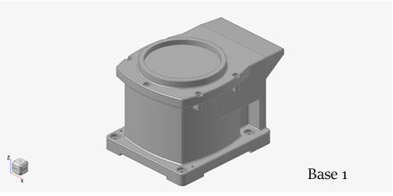
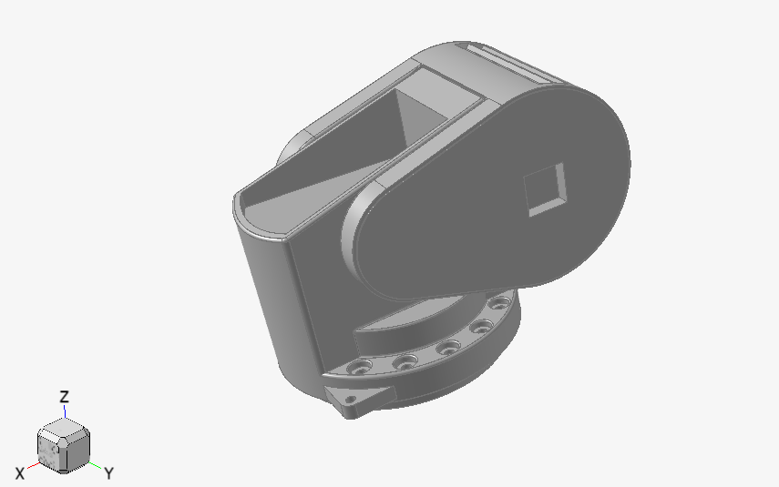
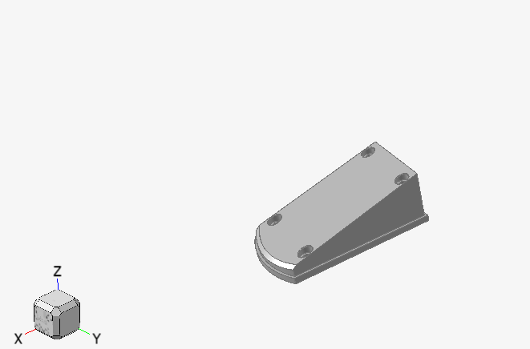
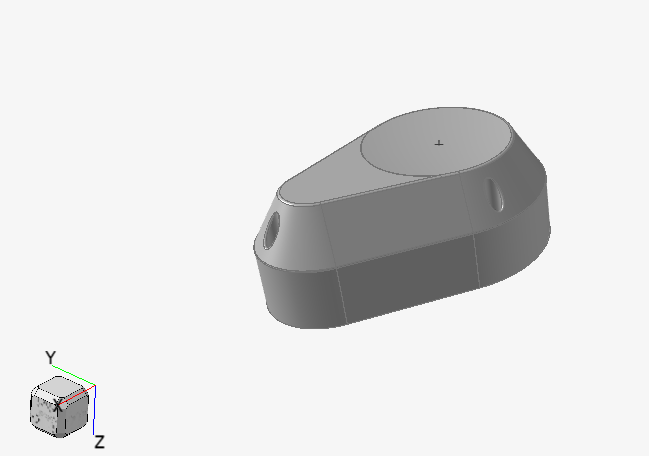

# Conception 3D avec Altair Inspire

## 📌 Description
Conception et optimisation d'un bras robotique articulé utilisant Altair Inspire pour la modélisation et l'analyse structurelle.

## 🛠️ Logiciels Utilisés
- **Altair Inspire** (conception générative et optimisation topologique)

## ✨ Fonctionnalités
- Optimisation de poids
- Simulation des contraintes
- Compatible impression 3D

## Projet:
- Partie 1:

  

- Partie 2:

  

- Partie 3:

  

- Partie 4:

  

